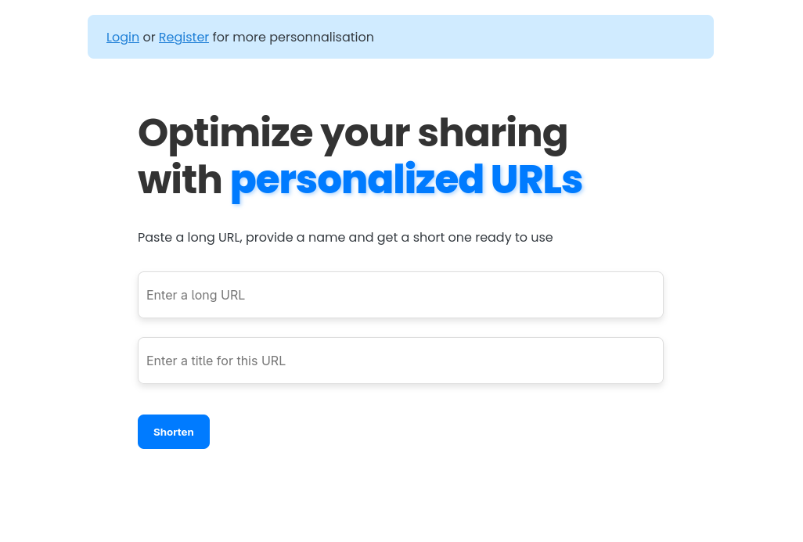

# URL Shortener

A personal project to shorten URLs.  
**Note:** This project is still under development, so there may be bugs or incomplete features.



## Installation

```bash
git clone git@github.com:tresor-del/urlshortener.git
cd urlshortene

```

## Usage

### Without Docker

1. Access the backend folder and run the backend app:

```bash
cd backend
python manage.py runserver
```
```bash
pip install -r requirements.txt
```
```bash
python manage.py runserver
```
2. Now go to the frontend and start the app: 

```bash
cd frontend
```
```bash
npm install --save-dev vite
```
```bash
npm run dev
```
3.And  access the application at `http://localhost:5173/`

### With Docker

```bash
docker compose up
```

## Configuration

- Edit the `.env` file to change configuration parameters if needed.

## Contributing

Contributions are welcome! Open an issue or a pull request.

